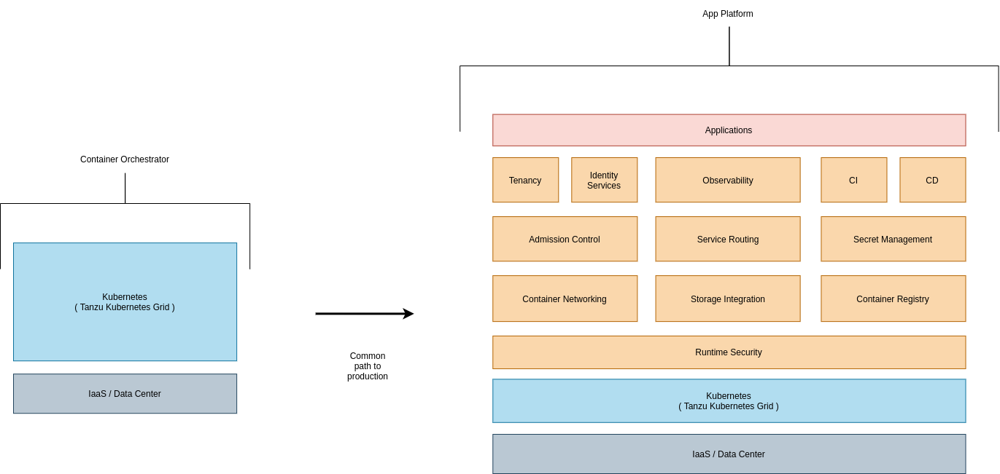
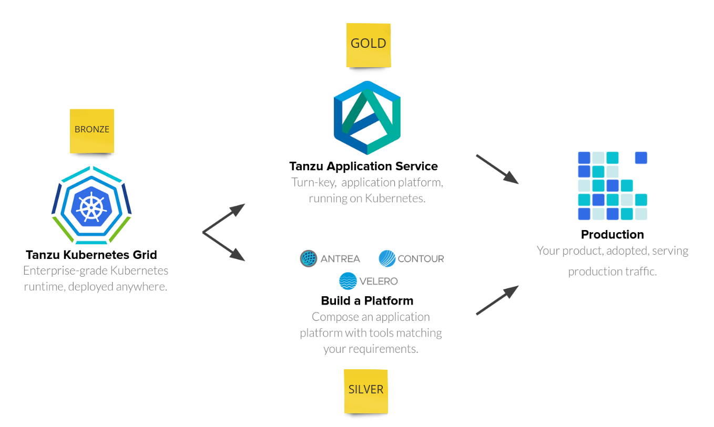

# RPK (Reference Platform for Kubernetes)

## Project Motivation

RPK demonstrates an end-to-end application platform running on top of
Kubernetes. For RPK, an application platform is defined as a viable place for running
production workloads. This is achieved by instantiating a workload orchestrator
(Kubernetes) and running platform services on top to provide applications what
they need to be successful in production. Technical decisions made in RPK can be used,
ignored, replaced, or mutated based on your unique infrastructure needs. RPK
includes a reference implementation and documentation.

* **Reference Implementation**: Modular automation enabling you to deploy
various platform services atop a Kubernetes cluster. For example, admission
control systems or service routing systems.

* **Documentation**: The documentation for RPK includes two types of assets. The
[Architecture Guide](docs/ARCHITECTURE.md) covers each module and how it architecturally interacts
with other components in the system. This enables the reader to understand how
RPK has made technical decisions and to ultimately adopt or build on those
decisions. Another is guides for cluster operators and developers. Cluster
operations discuss how to use and interact with various platform services.
The developer guides discuss application onboarding considerations to enable
platform adoption.

## Why is RPK Important?

Kubernetes is the ubiquitous means for orchestrating containerized workloads.
However, the path to production with Kubernetes is often misunderstood. Specifically,
Kubernetes itself is rarely a viable place to run production workloads. Instead
it provides a solid foundation for platform teams to deploy or build an
application platform. Instead of viewing Kubernetes as a next-generation
platform, we consider it to be the base to build on.

The above represents this common delta. For most, running Kubernetes in
production means defining, architecting, and implementing a specific
application platform solution. There is variance depending on the
organization and it's maturity and team dynamics. For example, many platform teams
wish to offer fully integrated secret management solutions, taking the onus off
application developers to re-implement this logic in every application and ensure
security best practices are followed. However, other teams may choose  to not
solve this concern at the platform level. This proves the end results has
significant variance per company. A key component to Kubernetes success is the
flexibility/extensibility to support these organizational preferences. RPK acts
as a reference implementation demonstrating these application platform
concerns. However, it is expected consumers of RPK will customize it to
fit their needs.

## How Does RPK Approach Building Blocks?

RPK approaches the building blocks (seen above in orange) by combining real-world
experience and proven implementations delivered to customers. There is high variance
in how customers approach each of these concerns, thus we take the most common
paths seen and expect our approaches to **evolve over time**.

## What Persona(s) is RPK Targeting?

Kubernetes user needs fit on a spectrum, typically landing in
one of 3 personas. Each persona envisions a slightly different path to
production. We often identify these personas as bronze, silver, and gold.

* **Bronze**: I want an enterprise-grade Kubernetes distribution. This persona
is largely interested in having the foundation poured but is not yet ready to
build the house. In our experience, the path to production with bronze is rarely
achieved without moving on to a silver or gold aspiration. However, the bronze
intention may be right for the customer at the time, especially when their
production intentions are largely non-determined.

* **Silver**: I want to **create** a viable place to run applications in production
with Kubernetes as the foundation. This persona not only wants to pour the
foundation, but also help design, build, and operationalize an application
platform on top - ensuring they end up with a habitable place for
applications to live (i.e., running in production).

* **Gold**: I want to **deploy** a fully-baked application platform that is
ready for production, with Kubernetes as the foundation. This persona wants to
adopt hardened opinions of a vendor - similar to an established housing developer,
they can have a quality, habitable, home built. This lowers the effort seen in
the Silver persona around architecting / building, although some extension may
be involved.

## Is RPK a VMware Product?

No. The intention of RPK is to capture common implementations delivered in the
field and make them automated and executable. This enables our architectures to
evolve over time and be used in several contexts. RPK can be used for:

* Proof-of-Concepts
* Field implementations (as a starting point that you build atop of)
* Internal and External Enablement

### Disclaimer

- RPK is intended to represent a reference implementation of what a modern application platform **could** look like.  There
are several other decisions that go into making an application platform "production ready".  RPK is not intended to produce a
production ready application platform, rather give an opinionated, sample view of what one may look like.

- RPK is not supported by VMware.  It is a tool that belongs to Tanzu Labs and is intended to be used by
those who wish to get acquainted with Kubernetes and the decisions that go into producing a fully fledged application platform.
Once again, the platform produced by RPK is a reference only and not intended to be production ready out of the box.

## License

RPK (Reference Platform for Kubernetes), formerly referred to as "Project Ivy", is a VMware project that is developed and open sourced under the MIT License.  View the [license file](./LICENSE) and [notice file](./NOTICE) in this repo for more information.

## Code of Conduct

Please review our Code of Conduct prior to getting started at [CODE-OF-CONDUCT.md](CODE-OF-CONDUCT.md)

## Getting Started

Interested in deploying?  View the getting started guide to deploy RPK at [docs/QUICKSTART.md](docs/QUICKSTART.md)

## Contributing Guide

Interested in contributing? View the contributing guide at [docs/CONTRIBUTING.md](docs/CONTRIBUTING.md)

## Questions

Questions?  Please feel free to open an issue or reach out to one of our [core maintainers](MAINTAINERS.md)
