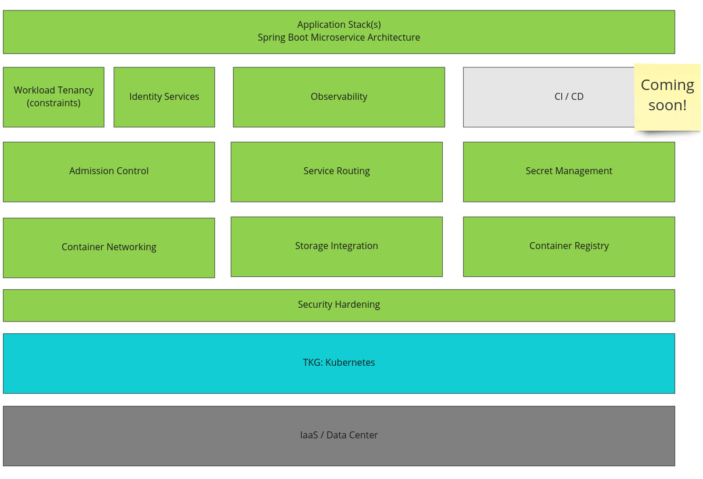
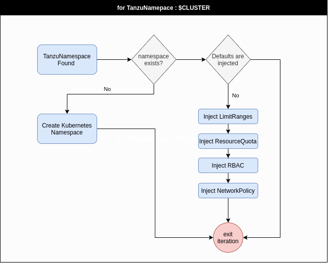
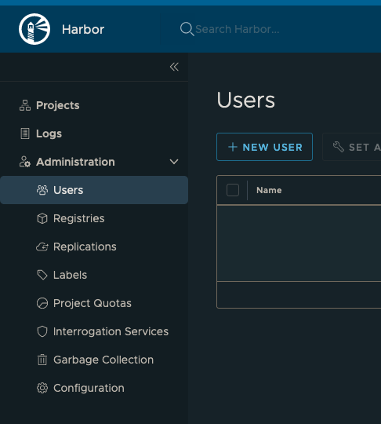
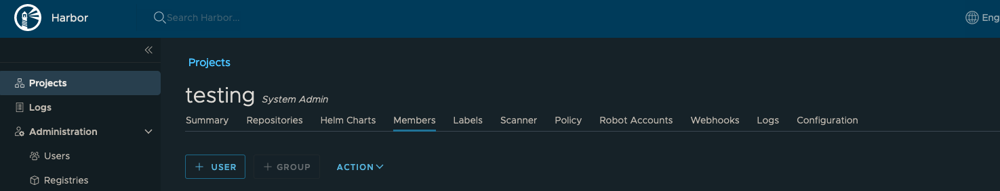
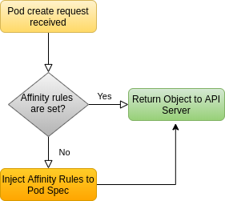
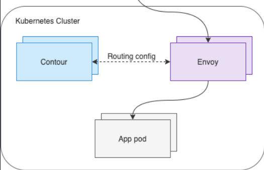
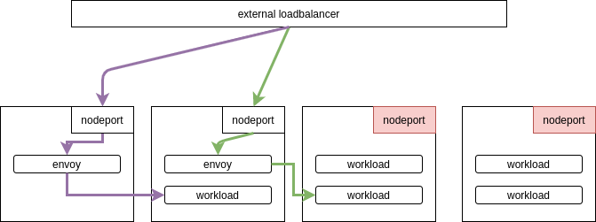
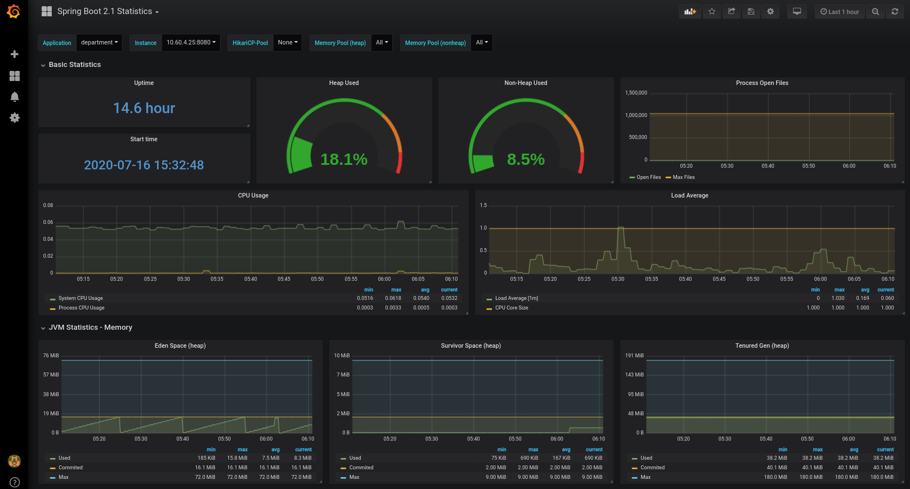
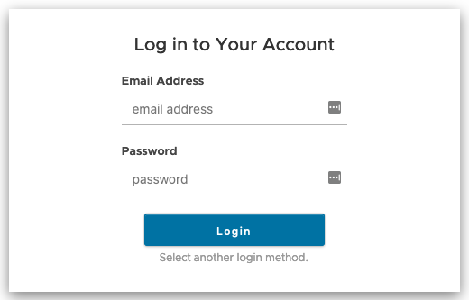

This document covers the architecture of every component within RPK. This
document can be used to understand the design decisions and help you determine
whether you'd like to align with RPK's approach, mutate it to fit your needs, or
ignore it altogether.



## Workload Tenancy

### Installed Components

* tanzu-workload-tenancy namespace
* TanzuNamespace custom resource definition
* namespace-operator deployment
* tanzu-default-resource-quota
* tanzu-default-limit-range
* RBAC resources (service accounts, roles, bindings, etc.)

### Dependencies

(none)

### How It Works

RPK sets up special namespace settings for every new namespace that is
provisioned. To do this, it leverages a custom [namespace-operator](https://github.com/vmware-tanzu-labs/namespace-operator).
Instead of creating namespaces directly, the operator looks for `TanzuNamespace`. An
example YAML is as follows.

```yaml
---
apiVersion: tenancy.platform.cnr.vmware.com/v1alpha1
kind: TanzuNamespace
metadata:
  name: Team-A
spec:
  tanzuNamespaceName: "Team-A"
```

Based on the above, the operator will provision a namespace with sensible
defaults for:

* ResourceQuotas
  * CPU
  * Memory
* LimitRanges
  * CPU
  * Memory
* NetworkPolicy
* RBAC

Following the operator model, constant reconciliation is performed, resulting
in a flow such as the following.



### Operator Guide

With the installed components created in the cluster, simply create a
TanzuNamespace custom resource.  The namespace-operator will set up the standard
components. If the defaults are not preferred or appropriate, customized values
can be applied for resource quotas and limit ranges.  For example:

```yaml
---
apiVersion: tenancy.platform.cnr.vmware.com/v1alpha1
kind: TanzuNamespace
metadata:
  name: Team-B
spec:
  tanzuNamespaceName: "Team-B"
  tanzuLimitRangeDefaultCpuLimit: "250m"
  tanzuLimitRangeDefaultMemoryLimit: "512Mi"
  tanzuLimitRangeDefaultCpuRequest: "250m"
  tanzuLimitRangeDefaultMemoryRequest: "512Mi"
  tanzuLimitRangeMaxCpuLimit: "2000m"
  tanzuLimitRangeMaxMemoryLimit: "2Gi"
  tanzuResourceQuotaCpuRequests: "8"
  tanzuResourceQuotaMemoryRequests: "6Gi"
  tanzuResourceQuotaCpuLimits: "8"
  tanzuResourceQuotaMemoryLimits: "6Gi"
```

However, all configuration under `spec` is optional, with the intention that developer will receive sensible defaults.

## Security Hardening

### Installed Components

* tanzu-security namespace
* Cert Manager custom resource definitions
* cert-manager deployment and service
* cert-manager-webhook deployment, service, API service, validating and mutating webhook configs
* cert-manager-cainjector deployment
* RBAC resources (service accounts, roles, bindings, etc.)

### Dependencies

* Workload Tenancy

### How It Works

RPK uses cert-manager to manage TLS assets.  This allows the creation and
rotation of certs to be handled by cert-manager.

Cert-manager uses Issuer resources to identify a certificate authority (CA).
You can provide the cert and private key pair for a CA you control or have
cert-manager generate a self-signed cert and private key.  Cert-manager can also
use other sources such as Let's Encrypt to issue certs.

Use Certificate resources to instruct cert-manager to generate TLS certs using
an Issuer.  Cert-manager will create the certs according to the details provided
in the spc and will store them as secrets.  Cert-manager will renew these certs
according to the `renewBefore` value provided in the Certificate spec.

### Operator Guide

You can provide a CA key pair as a secret and then create Issuer and Certificate
resources as follows:

```yaml
apiVersion: v1
kind: Secret
metadata:
  name: sample-ca-key-pair
data:
  tls.crt: [base 64 encoded CA cert]
  tls.key: [base 64 encoded private key for CA cert]
---
apiVersion: cert-manager.io/v1alpha2
kind: Issuer
metadata:
  name: sample-ca-issuer
spec:
  ca:
    secretName: sample-ca-key-pair  # references Secret above
---
apiVersion: cert-manager.io/v1alpha2
kind: Certificate
metadata:
  name: sample-cert
spec:
  # Secret names are always required.
  secretName: samplecert
  duration: 2160h # 90d
  renewBefore: 360h # 15d
  organization:
  - "Sample Org"
  commonName: samplename
  isCA: false
  keySize: 2048
  keyAlgorithm: rsa
  keyEncoding: pkcs1
  usages:
    - server auth
  # At least one of a DNS Name, USI SAN, or IP address is required.
  dnsNames:
  - sampleapp
  - sampleapp.{{ tanzu_ingress_namespace }}
  - sampleapp.{{ tanzu_ingress_namespace }}.svc
  - sampleapp.{{ tanzu_ingress_namespace }}.svc.cluster.local
  # Issuer references are always required.
  issuerRef:
    name: sample-ca-issuer  # references Issuer above
    # We can reference ClusterIssuers by changing the kind here.
    # The default value is Issuer (i.e. a locally namespaced Issuer)
    kind: Issuer
    # This is optional since cert-manager will default to this value however
    # if you are using an external issuer, change this to that issuer group.
    group: cert-manager.io
```

As an alternative to providing a key pair as a secret for the CA, you may
direct cert-manager to generate a self-signed CA as follows.  Then reference the
secret by the name given with `secretName` which is `sample-ca-key-pair` in this
example.

```yaml
apiVersion: cert-manager.io/v1alpha2
kind: Issuer
metadata:
  name: sample-selfsigned-ca-issuer
  namespace: "{{ tanzu_ingress_namespace }}"
spec:
  selfSigned: {}
---
apiVersion: cert-manager.io/v1alpha2
kind: Certificate
metadata:
  name: sample-ca
  namespace: "{{ tanzu_ingress_namespace }}"
spec:
  secretName: sample-ca-key-pair  # reference this secret in the Issuer
  duration: 8760h # 1year
  renewBefore: 360h # 15d
  organization:
  - "Project Sample"
  commonName: "Sample CA"
  isCA: true
  keySize: 2048
  keyAlgorithm: rsa
  keyEncoding: pkcs1
  usages:
    - server auth
    - client auth
  dnsNames:
  - sampleca
  issuerRef:
    name: sample-selfsigned-ca-issuer
    kind: Issuer
    group: cert-manager.io
```

## Storage Integration

### Installed Components

* tanzu-storage namespace
* VolumeSnapshot custom resource definitions
* CSI driver for platform-specific storage
* hostpath CSI driver
* csi-hostpathplugin statefulset and service
* csi-hostpath-attacher statefulset and service
* csi-hostpath-provisioner statefulset and service
* csi-hostpath-resizer statefulset and service
* csi-hostpath-snapshotter statefulset and service
* snapshot-controller statefulset
* an ephemeral storage class
* a vSan storage class (on vSphere)
* an EBS storage class (on AWS)
* RBAC resources (service accounts, roles, bindings, etc.)

### Dependencies

* Workload Tenancy

### How It Works

RPK sets up and configures CSI driver and storage classes based on your target
environment. RPK uses:

* Ephemeral
* vSAN/VMDK (vSphere only)
* EBS (AWS only)

The ephemeral storage class is made available in every cluster. By using the CSI
driver model, storage is provisioned based on need and made available to
applications with stateful requirements. The flow is as follows.


As seen above, RPK can be extended to include CSI for different providers, such
as Ceph, if that's desirable. A list of available CSI providers can be found
[here](https://kubernetes-csi.github.io/docs/drivers.html). For vSAN
specifically, the flow would look as follows.

The supporting storage classes, specific to the vSphere CSI-driver are as
follows.

```yaml

---
kind: StorageClass
apiVersion: storage.k8s.io/v1
metadata:
  name: "{{ storage_class.name }}"
  annotations:
    storageclass.kubernetes.io/is-default-class: "{{ storage_class.default_storage_class | default(tanzu_storage_class_defaults.default_storage_class) | string | lower }}"
allowVolumeExpansion: {{ storage_class.expandable | default(tanzu_storage_class_defaults.expandable) }}
provisioner: "{{ vmware_storage_class_provisioner }}"
reclaimPolicy: "{{ storage_class.reclaim_policy | default(tanzu_storage_class_defaults.reclaim_policy) }}"
parameters:
  storagepolicyname: "{{ storage_class.name }}"
  fstype: "{{ storage_class.file_system | default(tanzu_storage_class_defaults.file_system) }}"
mountOptions: {{ storage_class.mount_options | default(tanzu_storage_class_defaults.mount_options) }}

```


|**In-Tree Provders**|
|---|
|*There remain a few in-tree providers for storage in Kubernetes. In-tree means it's part of Kubernetes core, thus code for integrating with storage providers is backed into the control plane components. This approach is being deprecated and can surface many challenges, such as updating storage drivers independent of the Kubernetes control plane. We do not recommend updating RPK to use any in-tree providers.*|

### Operator Guide

With the installed components created in the cluster, you are able to leverage
dynamic storage provisioning by referencing the installed storage
classes.

View the storage classes you have available with `kubectl get sc`.  The examples
below show an example storage class name of `fast`.

You can use the `fast` storage class by creating a PersistentVolumeClaim as
follows:

```yaml
---
apiVersion: v1
kind: PersistentVolumeClaim
metadata:
  name: my-fast-claim
spec:
  accessModes:
    - ReadWriteOnce
  storageClassName: fast
  resources:
    requests:
      storage: 10Gi
```

Developers that wish to provision dynamic storage alongside their application manifest can do so easily using `volumeClaimTemplates`:

```yaml
apiVersion: apps/v1
kind: StatefulSet
metadata:
  name: my-stateful-app
spec:
  selector:
    matchLabels:
      app: my-stateful-app
  template:
    metadata:
      labels:
        app: my-stateful-app
    spec:
      containers:
      - name: my-stateful-app
        image: my-image:v1.0
        ports:
        - containerPort: 80
          name: web
        volumeMounts:
        - name: data-store
          mountPath: /var/lib/data
  volumeClaimTemplates:
  - metadata:
      name: data-store
    spec:
      accessModes: [ "ReadWriteOnce" ]
      storageClassName: fast
      resources:
        requests:
          storage: 10Gi
```

## Container Networking

### Installed Components

* tanzu-networking namespace
* a deny-all GlobalNetworkPolicy

### Dependencies

* Workload Tenancy

### How It Works

Networking in RPK is handled by the [CNI
plugin](https://github.com/containernetworking/cni) Calico. This handles
concerns from IPAM of pods to route sharing. Calico can be deployed atop most
network fabrics, including NSX. The high-level architecture of all Calico
components running in RPK is as follows.


At the host level, each node runs a `calico-node` pod. Inside this pod are 2
containers. These include `Felix` and `BIRD`.


**Felix** is responsible for programming the host to satisfy pod routes and network policy. To do this, it interacts with the Linux kernel’s route tables and the Linux IPtables (for network policy). Felix will configure the route tables statically translating what is learned to static routes in the host’s routing table. Calico’s use of IPtables can raise concerns around scalability, however the use of IPtables has a time complexity of O(1) 0 . Calico relies on kube-proxy to facilitate services, which (in IPtables mode) can have a complexity closer to O(n). This should be considered for clusters featuring thousands of services.

**BIRD** takes routing rules written by Felix and peers with other BIRD instances that run on all hosts by default. These BGP peers are constantly sharing routing information about their known routes. BIRD is a capable daemon that enables a multitude of topologies. This will be covered in greater depth in the Route Distribution section.

Calico uses a Kubernetes datastore driver. This enables users to configure
Calico using CRDs directly through the `kube-apiserver` rather than relying
on interacting with an external datastore such as an etcd instance.


#### Routing Mode

Calico supports 3 routing modes.

1. Native: Packets routed as-is, no encapsulation.

2. IP-in-IP: Minimal encapsulation; outer header includes host src/dst IPs and inner header includes pod src/dst.

3. VXLAN: Robust encapsulation using UDP over IP; outer header includes host src/dst IP addresses and inner header includes pod src/dst IP addresses as well as Ethernet headers.

RPK uses option `2`, which provides a light form of encapsulation that
works in most networks. When a host receives an IP-in-IP packet, it examines the
internal IP header to determine the target pod. This is Calico’s default routing
method. While this routing method incurs more overhead than native routing, it
does work in most environments without modification, especially in environments
that cross multiple subnets. When running in this mode, the packet structure
looks as shown in the diagram below:


In order to facilitate this model, Felix programs the route table to use ipip
tunnel interfaces to provide routing across nodes.


At the cost of the additional IP-in-IP overhead, this model works in most network topologies. Environments where this model can be problematic are:

* Environments that explicitly disallow IP-in-IP, such as Azure.
* Environments that block all BGP, which is used in this model for route distribution.

If you're environment cannot allow the above, RPK can be modified to setup Native or
VXLAN routing modes.

To minimize overhead intrasubnet, RPK runs in a `CrossSubnet` mode. This means
encapsulation (IP in IP) only occurs when it needs to, which is typically when
crossing subnet boundaries. In short, performance is optimized intrasubnet by
adding 0 overhead (processing and packet size) to traffic that does not leave
the originating subnet.


#### MTU Configuration

RPK **does not** setup the MTU as proper settings are contingent on your
network. You should evaluate RPK's default settings against the following
recommendations.

MTU calculation is done by determining the Network MTU and then subtracting
based on your routing configuration:

* Native: Subtract by `0`.
* IP-in-IP: Subtract by `20`.
* VXLAN: Subtract by `50`.

The following table shows 2 sets of example calculation:

|Network MTU   | Native MTU  | IP-in-IP MTU | VXLAN MTU |
|---|---|---|---|
| 1500  | 1500  | 1480 | 1450  |
| 9001 ([AWS Jumbo](https://docs.aws.amazon.com/AWSEC2/latest/UserGuide/network_mtu.html#jumbo_frame_instances))  | 9001 | 8981 | 8951 |

To set the MTU, the `calico-config` configmap can be set as follows:

```yaml
kind: ConfigMap
apiVersion: v1
metadata:
  name: calico-config
  namespace: kube-system
data:
  # other config omitted for brevity

  # SET THE MTU based on routing mode and network MTU
  veth_mtu: "1440"
```

If this is set after deployment, **only new pods will respect the MTU change**.
Any existing pods must be restarted or `calico-node` (on the host) must be restarted.

### Operator Guide

#### IPAM and Routing configuration

Modifications to Calico are made at the `IPPool` level. By default, and in most deployments, there is a single IPPool. To view or mutating the settings of this pool, you can use the following command.

```yaml
kubect get ippool
```

#### Network Policy

All namespaces that are not prefixed with `tanzu-` and not the `kube-system` namespace have **all** ingress and egress traffic denied by default. The only excpetion is DNS traffic (UDP:53). This means every namespace is fully microsegemented. The global policy can be queried by running the following.

```bash
kubectl get globalnetworkpolicy
```

When a workload is deployed that should receive or send traffic, a Kubernetes `NetworkPolicy` should be deployed with it opening up these flows. The following sample opens the namespace for workloads to received traffic on `TCP:6379` from workloads in the `project-a` namespace with the label `role: frontend`. It also enables workloads to send traffic to any workload in the `10.0.0.0/24` CIDR range.

```yaml
apiVersion: networking.k8s.io/v1
kind: NetworkPolicy
metadata:
  name: test-network-policy
  namespace: default
spec:
  podSelector:
    matchLabels:
      role: db
  policyTypes:
  - Ingress
  - Egress
  ingress:
  - from:
    - namespaceSelector:
        matchLabels:
          project: project-a
    - podSelector:
        matchLabels:
          role: frontend
    ports:
    - protocol: TCP
      port: 6379
  egress:
  - to:
    - ipBlock:
        cidr: 10.0.0.0/24
```

## Container Registry

### Installed Components

* tanzu-container-registry namespace
* harbor deployment, service, configmaps, secrets and ingress
* chartmuseum deployment, configmap, service, pvc and secrets
* clair deployment, service and secrets
* harbor database statefulset, service and secret
* harbor jobservice deployment, service, configmaps, pvc and secrets
* harbor nginx deployment, service, configmaps and secret
* notary-server deployment, service and secret
* notary-signer deployment and service
* harbor portal deployment, service, configmap and secret
* redis statefulset and service
* registry deployment, service, configmap, pvc and secrets
* trivy statefulset, service and secrets
* internal TLS secrets
* RBAC resources (service accounts, roles, bindings, etc.)

### Dependencies

* Workload Tenancy
* Security Hardening
* Storage Integration
* Service Routing

### How It Works

RPK leverages [Harbor](https://goharbor.io/) for container registry services.
You can also store helm charts, digitally sign images using Notary and use Clair
to scan images for security vulnerabilities.

The Harbor deployment on RPK includes:
* The core Harbor container registry
* PostgreSQL database for application data
* A Notary server that allows container image publishers to digitally sign
  images so that users can verify the origin of the images they use.
* An administrative portal
* Redis for caching
* Chartmuseum for Helm chart storage
* Clair for image scanning

### Operator Guide

The container registry can be accessed at `registry.${tanzu_ingress_domain}`.
Make sure you access the portal on an https connection and you can log in using
the `harbor_admin_username` and `harbor_admin_password` ansible variables.

Once logged in, navigate to the Users section under
Administration:



Add a new user for pushing images to your registry.

Next, use the harbor docs to [create a new
project](https://goharbor.io/docs/2.0.0/working-with-projects/create-projects/)
and assign users to the project.

Add the new user you created as a member of the project by clicking "+ USER"
under the Members section for your newly created project:



Follow the [harbor
docs](https://goharbor.io/docs/2.0.0/working-with-projects/working-with-images/pulling-pushing-images/)
for managing images with docker.  Don't forget to follow the instructions to
download the the harbor certificate if using a self-signed CA.

If you created a Project called `myproject` and pushed an image called
`myimage:v1` you can now reference the image with
`registry.${tanzu_ingress_domain}/myproject/myimage:v1` in a pod manifest.
Don't forget to include the `imagePullSecrets` in your pod manfiest as shown in
the [Kubernetes
docs](https://kubernetes.io/docs/tasks/configure-pod-container/pull-image-private-registry/).

## Secret Management

### Installed Components

* an EncryptionConfiguration for etcd
* tanzu-secrets namespace
* hashicorp-vault-agent-injector deployment, service and mutating webhook config
* hashicorp-vault statefulset, headless service, configmap, ingress
* RBAC resources (service accounts, roles, bindings, etc.)

### Dependencies

* Workload Tenancy
* Service Routing

### How It Works

#### etcd Encryption

RPK configures etcd encryption using a static key. Automation will provision and
enable the encryption key for all new Secret objects submitted to the
`kube-apiserver`.


With RPK's encryption set up, policies for key retention and rotation must be
defined.  Extending RPK's automation and validating that it can rotate keys **is
crucial**.  Based on a schedule, the key should be rotated. To rotate keys, one
must add a new key to the top of the list inside the provider. Since this key is
first, it will be used for all new encryption. When secret objects are updated,
they will be re-encrypted using this new key over time. Until then, the original
key can remain in the list as a fall back decryption option.

#### Vault Integration

RPK installs Vault as a secondary, enterprise-grade, secret store that can be
used to host application secrets. It is configured such that secrets can be
retrieved from Vault and injected into applications transparently. This
injection flow looks as follows.


This approach runs an
[initContainer](https://kubernetes.io/docs/concepts/workloads/pods/init-containers)
and/or sidecar container to communicate with an external secret store. Typically, secrets
are injected into the pod's filesystem, making them available to all containers
running in a pod. We **highly recommend** this approach when possible. The major
benefit is it decouples the secret store entirely from the application. However,
this does make the platform more complex, as facilitating secret injection is
now an offering of the Kubernetes-based platform.

Vault's implementation of this model uses a
[MutatingWebook](https://kubernetes.io/docs/reference/access-authn-authz/extensible-admission-controllers/)
pointed at a `vault-agent-injector`. As pods are created, based on annotations,
the vault-agent-injector adds an `initContainer` (used for retrieval of
the initial secret) and a sidecar container to keep secrets updated, if needed.

To facilitate mutation via the `vault-agent-injector`, a
`MutatingWebhookConfiguration` is added, as follows.

```yaml
apiVersion: admissionregistration.k8s.io/v1
kind: MutatingWebhookConfiguration
metadata:
  labels:
    app.kubernetes.io/instance: vault
    app.kubernetes.io/managed-by: Helm
    app.kubernetes.io/name: vault-agent-injector
  name: vault-agent-injector-cfg
webhooks:
- admissionReviewVersions:
  - v1beta1
  clientConfig:
    caBundle: REDACTED
    service:
      name: vault-agent-injector-svc
      namespace: default
      path: /mutate
      port: 443
  failurePolicy: Ignore
  matchPolicy: Exact
  name: vault.hashicorp.com
  namespaceSelector: {}
  objectSelector: {}
  reinvocationPolicy: Never
  rules:
  - apiGroups:
    - ""
    apiVersions:
    - v1
    operations:
    - CREATE
    - UPDATE
    resources:
    - pods
    scope: '*'
  sideEffects: Unknown
  timeoutSeconds: 30
```

The mutating webhook is invoked on **every** pod `CREATE` or `UPDATE` event.
While evaluation will occur on every pod, not every pod will be mutated, or
injected with a `vault-agent`. The `vault-agent-injector` is looking for 2
annotations in every pod spec.

* `vault.hashicorp.com/agent-inject: "true"`: Instructs the injector to include a
  `vault-agent` `initContainer`, which retrieves secrets and writes them to the
  pod's filesystem, prior to other containers starting.
* `vault.hashicorp.com/agent-inject-status: "update"`: Instructs the injector to
  include a `vault-agent` sidecar, which runs alongside the workload. It will
  update the secret, should it change in Vault. The `initContainer` still runs
  in this mode. This parameter is optional and when it is not included, the
  sidecar is not added.

When the `vault-agent-injector` does a mutation based on
`vault.hashicorp.com/agent-inject: "true"`, the following is added.

```yaml
initContainers:
- args:
  - echo ${VAULT_CONFIG?} | base64 -d > /tmp/config.json && vault agent -config=/tmp/config.json
  command:
  - /bin/sh
  - -ec
  env:
  - name: VAULT_CONFIG
    value: eyJhd
  image: vault:1.3.2
  imagePullPolicy: IfNotPresent
  name: vault-agent-init
  securityContext:
    runAsGroup: 1000
    runAsNonRoot: true
    runAsUser: 100
  volumeMounts:
  - mountPath: /vault/secrets
    name: vault-secrets
```

> Some configuration was removed for brevity.

When the `vault-agent-injector` sees the annotation
`vault.hashicorp.com/agent-inject-status: "update"`, the following is added.

```yaml
containers:
  #
  # ORIGINAL WORKLOAD CONTAINER REMOVED FOR BREVITY
  #
- name: vault-agent
  args:
  - echo ${VAULT_CONFIG?} | base64 -d > /tmp/config.json && vault agent -config=/tmp/config.json
  command:
  - /bin/sh
  - -ec
  env:
  - name: VAULT_CONFIG
    value: asdfasdfasd
  image: vault:1.3.2
  imagePullPolicy: IfNotPresent
  securityContext:
    runAsGroup: 1000
    runAsNonRoot: true
    runAsUser: 100
  volumeMounts:
  - mountPath: /vault/secrets
    name: vault-secrets
```

> Some configuration was removed for brevity.

|**Vault image**|
|---|
|*An unfortunate detail (as of March 2020) of the vault-sidecar implementation is the use of the **entire** [vault image](https://hub.docker.com/_/vault). This is the entire image (~50Mb) used to run a Vault server, not just a client. Thus there is unneeded bloat from packages, code, and more.*|


With the agents present, they will retrieve and download secrets based on the
pod annotations, such as the following annotation that requests a database secret
from Vault.

```
vault.hashicorp.com/agent-inject-secret-db-creds: "serets/db/creds"
```

By default, secret value will be persisted as if a [Go
map](https://tour.golang.org/moretypes/19) was printed out.  Syntactically, it
appears as follows. All secrets are put into `/vault/secrets`.

```txt
key: map[k:v],
key: map[k:v]
```

> Where `k` would be the key and `v` would be the value.

To ensure formatting of a secret is optimal for consumption, Vault supports
adding templates into the annotation of pods. This uses standard [Go
templating](https://golang.org/pkg/text/template/). For example, to create a
JDBC connection string, the following template can be applied to a secret named
`creds`.

```yaml
spec:
  template:
    metadata:
      annotations:
        vault.hashicorp.com/agent-inject: "true"
        vault.hashicorp.com/agent-inject-status: "update"
        vault.hashicorp.com/agent-inject-secret-db-creds: "secrets/db/creds"
        vault.hashicorp.com/agent-inject-template-db-creds: |
          {{- with secret "secrets/db/creds" -}}
          jdbc:oracle:thin:{{ .Data.data.username }}/{{ .Data.data.password }}@//192.168.34.212:4464/app
          {{- end }}
```

If using Vault's sidecar injector, be sure to review [the available
annotations](https://www.vaultproject.io/docs/platform/k8s/injector/annotations).

|**Productionalizing Vault**|
|---|
|*While RPK deploys an instance of Vault to demonstrate the above pattern, users of Vault must consider a production-grade deployment model, which RPK does not follow. Vault is a popular open source project, for solving enterprise-security concerns, but your operational maturity of being able to manage Vault over time should be considered.*|

### Operator Guide

#### etcd Encryption Key Rotation

No work needs to be done to encrypt secrets. However, a key rotation strategy should be established where automation does the following.

* Generates a new encryption key
* Copies the encryption key to the host
* Updates the `EncryptionConfiguration`

When completed, all **new** secrets are encrypted and decrypted with the new key. Operators should keep previous keys around to ensure existing secrets, that have not been re-encrypted with the new key, may still be decrypted.

#### Vault

The Vault UI may be accessed at `secret.${tanzu_ingress_domain}`, where `tanzu_ingress_domain` is set during installation. Setting up authentication for service accounts with Kubernetes can be found [here](https://www.vaultproject.io/docs/auth/kubernetes). After access is configured, workloads may request secrets from vault by setting the following annotations.

```yaml
vault.hashicorp.com/agent-inject: "true"
vault.hashicorp.com/agent-inject-status: "update"
vault.hashicorp.com/agent-inject-secret-db-creds: "secrets/db/creds"
```

The `agent-inject-status: update` annotation instructs vault to run a sidecar that will constantly check for updates to the secret in Vault. If an update is found, it will re-inject the secret.

As a platform operator, you can also setup additional [authenticaion methods](https://www.vaultproject.io/docs/auth) for allowing application to directly communicate with Vault. However, this default models enables secrets to be mounted directly in the pod like any other secret, meaning the application does not need to know where the secret came from.

## Admission Control

### Installed Components

* tanzu-admission namespace
* Gatekeeper custom resource definitions
* gatekeeper-audit deployment
* gatekeeper-webhook service and validating webhook config
* sac deployment, service and mutating webhook config
* container-limits constraints and constraint templates
* container-ratio constraints and constraint templates
* required-labels constraints and constraint templates
* pod security policy constraints and constraint templates:
    * privileged-containers
    * host-namespaces
    * host-network-ports
    * volumes
    * host-filesystem
    * flexvolume-drivers
    * fsgroup
    * read-only-root-filesystem
    * users
    * allow-privilege-escalation
    * capabilities
    * seLinux
    * proc-mount
    * apparmor
    * seccomp
    * forbidden-sysctls
* RBAC resources (service accounts, roles, bindings, etc.)

### Dependencies

* Workload Tenancy

### How It Works

RPK provides constructs for both validating and mutating control at the
admission layer. The admission layer is encapsulated in the `kube-apiserver` for
incoming requests. Both machines and human requests are put through this layer.
The flow is as follows.


All admission controllers run as services in the cluster. They are wired
together using `WebhookConfigurations`. RPK deploys these by default, but an
example of a configuration that send new pod creation requests out to get
mutated is as follows.

```yaml
apiVersion: admissionregistration.k8s.io/v1
kind: MutatingWebhookConfiguration
metadata:
  name: "test-mutating-hook"
webhooks:
- name: "test-mutating-hook"
  # Matching rules. What API / kind / version / operations should this webhook be sent.
  rules:
  - apiGroups:   [""]
    apiVersions: ["v1"]
    # The operation that should trigger a call to the webhook.
    operations:  ["CREATE"]
    # Which kind to target.
    resources:   ["pods"]
    # Whether Namespace-scoped or cluster-scoped resources should be targeted.
    scope:       "Namespaced"
  # Describes how the API server should connect to the webhook. In this case it's in cluster at `test-service.test-ns.svc`.
  clientConfig:
    service:
      namespace: test-ns
      name: test-service
      path: /test-path
      port: 8443
    # A PEM encoded CA bundle which will be used to validate the webhook's server certificate.
    caBundle: "Ci0tLS0tQk...tLS0K"
  # Declare the admissionReviewVersions that the webhook supports.
  admissionReviewVersions: ["v1", "v1beta1"]
  # Describes whether the webhook has external side effects (calls / dependencies to external systems).
  sideEffects: None
  # How long to wait until triggering the failurePolicy.
  timeoutSeconds: 5
  # Whether this webhook can be re-invoked (this may happen after other webhooks have been called).
  reinvocationPolicy: IfNeeded
  # Whether the webhook should fail 'open' or 'closed. This has security implications.
  failurePolicy: Fail
```

In the above, these requests will be sent to a service running as `test-service`
in the `test-ns` namespace.

#### Mutating Control

RPK deploys a scheduling default mutating controller. This controller is written
in Go and available to fork/clone at
[vmwarepivotallabs/scheduling-defaults-webhook](https://github.com/vmwarepivotallabs/scheduling-defaults-webhook).
It covers a common use case where platform teams wish to include a default
antiaffinity rule when one isn't specified. The flow is as follows.



When a workload is submitted
and no affinity rules are specified, the default applied is as follows.

```yaml
affinity:
  podAntiAffinity:
    requiredDuringSchedulingIgnoredDuringExecution:
    - labelSelector:
        matchExpressions:
        - key: app
          operator: In
          values:
          - ${APP_LABEL_VAULE}
      topologyKey: "kubernetes.io/hostname"
```

The impact of this rule is to tell the scheduler to prefer not scheduling the
same pod on the same node. This is achieved by evaluating the `app` label on the
pod. This impact of this is better resiliency should a node fail.

#### Validating Control

RPK leverages [Open Policy Agent](https://www.openpolicyagent.org) (OPA) to handle all
**validation** logic. OPA is used as it provides a DSL, rego, where policies can
be written and added without writing code. This provides centralized and
consistent policy administration. The flow looks as follows.


RPK deploys OPA using
[Gatekeeper](https://github.com/open-policy-agent/gatekeeper), which provides a
more Kubernetes-native way to deploy open policy agent and supports the
[constraint
template](https://github.com/open-policy-agent/frameworks/tree/master/constraint)
framework. By default, the following validation is enabled in RPK:

* Users must run as non-root and be part of a non-root user group.
* Pods must have the `app` label specified.

This validation is performed on any object not submitted to `tanzu-*` namespace.

Expanding the rules in RPK is just a matter of modifying the constraints and
constraint templates, for example the label constraint listed above is in the
form for the following template.

```yaml
---
apiVersion: templates.gatekeeper.sh/v1beta1
kind: ConstraintTemplate
metadata:
  name: k8srequiredlabels
spec:
  crd:
    spec:
      names:
        kind: K8sRequiredLabels
        listKind: K8sRequiredLabelsList
        plural: k8srequiredlabels
        singular: k8srequiredlabels
      validation:
        # Schema for the `parameters` field
        openAPIV3Schema:
          properties:
            labels:
              type: array
              items: string
  targets:
    - target: admission.k8s.gatekeeper.sh
      rego: |
        package k8srequiredlabels

        violation[{"msg": msg, "details": {"missing_labels": missing}}] {
          pod := input.review.object.metadata.name
          namespace := input.review.object.metadata.namespace
          provided := {label | input.review.object.metadata.labels[label]}
          required := {label | label := input.parameters.labels[_]}
          missing := required - provided
          count(missing) > 0
          msg := sprintf("you must provide labels: <%v> for pod: <%v>, in namespace: <%v>", [missing, pod, namespace])
        }
```

The constraints taken by the above template are as follows.

```yaml
---
apiVersion: constraints.gatekeeper.sh/v1beta1
kind: K8sRequiredLabels
metadata:
  name: require-app-label
spec:
  match:
    # NOTE: TKG deploys with pods which do not contain the app label, so we want to exclude them
    excludedNamespaces:
      - "kube-system"
      # TODO: elasticsearch and kibana are managed via the elastic operator.  the kibana resource
      #       fails to add the app label in the PodTemplate spec.  find out why.
      - "tanzu-logging"
    kinds:
      - apiGroups: ["extension", "apps"]
        kinds:
          - Deployment
      - apiGroups: [""]
        kinds:
          - Pod
  parameters:
    labels: ["app"]
```

As you can see, adding more labels to the `parameters` list above enables you to
add more required labels. There are also mechanisms for evaluating over regex.
See the [gatekeeper policy
library](https://github.com/open-policy-agent/gatekeeper/tree/master/library)
for additional examples.

### Operator Guide

#### Mutation

The mutating controller can easily be updated or replicated to create additional defaulting logic for workloads submitted to the cluster. Below you can see the code that constructs the part of the specification the controller patches, once adjusted to your needs, you re-use the `PatchResponseFromRaw`, which will respond back to the `kube-apiserver`.

```go
// Construct affinity default
matchLabels := []metav1.LabelSelectorRequirement{
	{
		Key:      afLabel,
		Operator: metav1.LabelSelectorOpIn,
		Values:   []string{pod.Labels[afLabel]},
	},
}
pat := v1.WeightedPodAffinityTerm{
	Weight: 50,
	PodAffinityTerm: corev1.PodAffinityTerm{
		TopologyKey: topKey,
		LabelSelector: &metav1.LabelSelector{
			MatchExpressions: matchLabels,
		},
	},
}
af := &v1.PodAntiAffinity{
	PreferredDuringSchedulingIgnoredDuringExecution: []v1.WeightedPodAffinityTerm{pat},
}
affinity := &v1.Affinity{PodAntiAffinity: af}

// Apply affinity default to pod; patch pod
log.Info(fmt.Sprintf("%s patching with default affinity.", podName))
pod.Spec.Affinity = affinity
marshaledPod, err := json.Marshal(pod)
if err != nil {
	return admission.Errored(http.StatusInternalServerError, err)
}

return admission.PatchResponseFromRaw(req.Object.Raw, marshaledPod)
```

#### Validation

All validating logic is implemented using [OPA constraint templates](https://github.com/open-policy-agent/frameworks/tree/master/constraint). This consists of two peices. One is the `ConstraintTemplate`, which uses rego to define evaulation logic. The other is the `Constraint` itself. The `Constraint` is a CRD automatically created by gatekeeper. It enables you to administer static or dynamic values to use in the policy. For example, the default in RPK uses a `Constraint`, which contains a list of required labels.

To get ideas on how to write these `ConstraintTemplates` and `Constraints`, see the [gatekeeper library of example policies](https://github.com/open-policy-agent/gatekeeper/tree/master/library).

## Service Routing

### Installed Components

* tanzu-ingress namespace
* Contour custom resource definitions
* contour deployment, service and configmap
* envoy daemonset and service
* contour-ca-issuer and contour-selfsigned-ca-issuer cert-manager issuer
* contour-ca, contour-cert and envoy-cert cert-manager certificate
* metallb-controller deployment (on vSphere)
* metallb-speaker deamonset (on vSphere)
* RBAC resources (service accounts, roles, bindings, etc.)

### Dependencies

* Workload Tenancy
* Security Hardening

### How It Works

RPK deploys [Contour](https://github.com/projectcontour/contour) to handle
service routing for requests entering the cluster that must be routed to a
container. Contour is a packaging of a controller (Contour) that syncs Ingress
configurations with envoy instances that act as load balancers in the cluster.
The relationship looks as follows.



RPK sets up contour such that it is routed into via NodePorts and exposed via an
external Loadbalancer.



|**You May Wish to Modify this Model!**|
|---|
|*While the above nodeport artchitecture is adequate for many use cases, often it's beneficial to run contour on dedicated hosts where there is no concern of performance variation based on the current stress that node is undergoing. <br/><br/>Additionally, simplifying lifecycle management concerns by ensuring contour is not impacted by other workloads, such as another container saturating network i/o. An alternative model we recommend is running on dedicated nodes and setting up contour to attach to the `hostNetwork` of those hosts. This provides ideal (and more predictable) performance of the ingress layer.*|

### Operator Guide

Contour will allow you to define ingress with either the native Kubernetes
Ingress resource or the HTTPProxy custom resource.

#### HTTP proxying

Exposing applications over HTTP is the most basic pattern. Clients send an HTTP
request that is routed to Envoy. Once there, Envoy inspects the HTTP request and
routes it to a backend pod according to the Ingress or HTTPProxy configuration.

Given the following HTTPProxy resource, Envoy will route requests to the `app1`
Service when the request has a Host header of `app1.example.com`.

```yaml
apiVersion: projectcontour.io/v1
kind: HTTPProxy
metadata:
  name: app1
spec:
  virtualhost:
    fqdn: app1.example.com
  routes:
    - conditions:
      - prefix: /
      services:
        - name: app1
          port: 80
```

The following diagrams shows the flow of the request:


#### Exposing applications with TLS (HTTPS)

Contour supports exposing applications over HTTPS. To make routing decisions
according to the request, Envoy needs to decrypt the incoming TLS connection.
That is, Envoy terminates the TLS connection and then routes the request to the
backend server over an unencrypted connection.

Building on the previous example, the following configuration tells Envoy to
expose `app1` over HTTPS using the certificate and private key contained in the
`tls-cert` Secret.

```yaml
apiVersion: projectcontour.io/v1
kind: HTTPProxy
metadata:
  name: app1
spec:
  virtualhost:
    fqdn: app1.example.com
    tls:
      secretName: tls-cert
  routes:
    - conditions:
      - prefix: /
      services:
        - name: app1
          port: 80
```

The following diagram shows the request flow:


When TLS is enabled, Envoy redirects HTTP clients to the HTTPS endpoint. The
redirect is enabled by default when using TLS, but it can be disabled on
specific routes by setting `permitInsecure: true`. The following diagram shows
the redirect to the secure endpoint:


#### TLS connection to an HTTP backend

As mentioned above, Envoy establishes an unencrypted connection to the backend
service when TLS is enabled. Envoy can, however, create a secure connection when
necessary. If the backend exposes a secure endpoint and expects a TLS
connection, you can set the protocol field to `tls` in the route configuration.

The following sample HTTPProxy resource sets the `protocol` field of the `app1`
service to `tls`:

```yaml
apiVersion: projectcontour.io/v1
kind: HTTPProxy
metadata:
  name: app1
spec:
  virtualhost:
    fqdn: app1.example.com
    tls:
      secretName: tls-cert
  routes:
    - conditions:
      - prefix: /
      services:
        - name: app1
          port: 443
          protocol: tls
```

The following diagram shows the connections given the above configuration:


By default, Envoy **does not** validate the backend's serving certificate. To enable
validation, you must specify a `caSecret` and `subjectName` in the HTTPProxy
configuration:

```yaml
apiVersion: projectcontour.io/v1
kind: HTTPProxy
metadata:
  name: app1
spec:
  virtualhost:
    fqdn: app1.example.com
    tls:
      secretName: tls-cert
  routes:
    - conditions:
      - prefix: /
      services:
        - name: app1
          port: 443
          protocol: tls
          validation:
            caSecret: ca-cert
            subjectName: app1.example.com
```

#### Exposing TCP services

In addition to HTTP services, Contour can also expose TCP services through
Envoy. The only requirement is that the incoming TCP connection is encrypted
with TLS and that the client indicates the destination hostname using [Server
Name Indication (SNI)](https://tools.ietf.org/html/rfc6066#page-6). Envoy needs
this indication to route the connection to the appropriate backend.

TCP proxying is configured using the `tcpproxy` field of the HTTPProxy custom
resource, as in the following example:

```yaml
apiVersion: projectcontour.io/v1
kind: HTTPProxy
metadata:
  name: tcp-svc
spec:
  virtualhost:
    fqdn: tcp-app.example.com
    tls:
      secretName: tls-secret
  tcpproxy:
    services:
    - name: tcp-app
      port: 8080
```

With the above configuration, Envoy first inspects the SNI extension to
determine the destination server. Once identified, it terminates the TLS
connection and forwards the TCP traffic over an unencrypted connection.


#### TLS passthrough

If the backend TCP service needs to handle the TLS connection, you can enable
TLS passthrough. In this mode, Envoy inspects the SNI extension to determine the
backend service but does not terminate the TLS connection. Instead, it forwards
the TLS connection to the backend service.

To enable TLS passthrough, set `tls.passthrough = true`, as in the following
HTTPProxy example:

```yaml
apiVersion: projectcontour.io/v1
kind: HTTPProxy
metadata:
  name: tcp-svc
spec:
  virtualhost:
    fqdn: tcp-app.example.com
    tls:
      passthrough: true
  tcpproxy:
    services:
    - name: tcp-app
      port: 8080
```


## Observability

### Installed Components

* tanzu-monitoring namespace
* Prometheus Operator custom resource definitions
* prometheus-operator deployment and service
* prometheus instance and service with servicemonitors and prometheusrule for platform
* prometheus ingress
* alertmanager instance for platform
* alertmanager ingress
* grafana deployment, service, secrets, configmaps, servicemonitor and ingress
* kube-state-metrics deployment, service and servicemonitor
* node-exporter daemonset, service and servicemonitor
* prometheus-adapater deployment, service, configmap and apiservice
* tanzu-logging namespace with ephemeral-storage resource quota
* Elasticsearch Operator custom resource definitions
* elastic-operator statefulset
* elastic-webhook service and validating webhook config
* elasticsearch instance and elastic-user password secret
* kibana instance and ingress
* fluent-bit daemonset and configmap
* RBAC resources (service accounts, roles, bindings, etc.)

### Dependencies

* Workload Tenancy
* Service Routing
* Storage Integration

### How It Works

RPK deploys a monitoring stack that is composed of Prometheus and Alertmanager.
It also deploys a logging stack composed of Elastic Search, Fluentbit, and
Kibana (EFK).


The monitoring stack is managed by the
[prometheus-operator](https://github.com/coreos/prometheus-operator), which
enables creation of prometheus instances based on CRDs. Along with monitoring
system components, this model enables development teams to easily provision
their own Prometheus and scrape metrics.

#### Cluster Monitoring

Grafana provides the cluster administrator with a single pane of glass view into
the Kubernetes cluster operations. Using Dashboards, Grafana can present the
monitoring data with respect to time in a way that is meaningful for measuring
the health of infrastructure, workloads, and network related data.


#### Application Monitoring

Application Monitoring is handled by describing [ServiceMonitors]() which allow
endpoints to be automatically detected and scraped.


RPK's sample applications configure service monitors that appear as follows.

```yaml
apiVersion: monitoring.coreos.com/v1
kind: ServiceMonitor
metadata:
  name: "{{ tanzu_app_stack_namespace_department }}-monitor"
  namespace: "{{ tanzu_app_stack_namespace_department }}"
  labels:
    prometheus: "{{ tanzu_app_stack_monitoring_prometheus_label }}"
    app: prometheus
spec:
  selector:
    matchLabels:
      app: "{{ tanzu_app_stack_department_app_name }}"
  namespaceSelector:
    matchNames:
    - "{{ tanzu_app_stack_namespace_department }}"
  endpoints:
  - port: "web"
    path: "{{ tanzu_app_stack_monitoring_app_metrics_path }}"
    interval: 60s
```

This enables automatic detect of the endpoint to scrape, and in effect provides
visibility into all the metrics exposed, in this case, by the [spring
actuator](https://docs.spring.io/spring-metrics/docs/current/public/prometheus).



#### Log Aggregation

RPK deploys [fluentbit](https://fluentbit.io) as the log forwarding agent on
every Kubernetes node. To do this, it's deployed as a daemonset. Fluentbit is
configured to point to the EFK stack, also deployed by RPK. RPK expects you'll
modify the fluentbit configuration to point to your desired backend, be it
Log Insight, Splunk, etc.

|**Productionalizing EFK**|
|---|
|*The EFK stack deployed by RPK is used to demonstrate a logging backend where forwarded logs can be received, indexed, and searched. The EFK stack deployed by RPK is **not** production ready. If using EFK, like other open source projects, users should consider the operational experience required to run an open source project with this amount of complexity.*|

### Operator Guide

#### Logging

The Kibana UI may be accessed at `logs.${tanzu_ingress_domain}`, where `tanzu_ingress_domain` is set during installation. Additional operator details **coming soon**.

#### Monitoring

The various monitoring components can be accessed at:

* `monitor.${tanzu_ingress_domain}`: grafana dashboard
* `metrics.${tanzu_ingress_domain}`: prometheus
* `alert.${tanzu_ingress_domain}`: alertmanager

Details on further monitoring and alerting configuration **coming soon**.

## Identity Services

### Installed Components

* tanzu-identity namespace
* TanzuNamespace custom resource definition
* dex deployment, service, configmap, ingress, cert manager issuers and certs
* gangway deployment, service, configmap, secret, ingress, cert manager
  issuer and cert
* ldap deployment, service and configmap
* tanzu-default-resource-quota
* tanzu-default-limit-range
* dex-ca-delivery job
* kube-apiserver-config job
* RBAC resources (service accounts, roles, bindings, etc.)

### Dependencies

* Workload Tenancy
* Security Hardening
* Service Routing

### How It Works

Identity services in RPK are handled by [Dex](https://github.com/dexidp/dex)
as the OIDC provider and [Gangway](https://github.com/heptiolabs/gangway) as the
user interface to enable the authentication flow.  Also included is an OpenLDAP
server to act as a sample identity provider.

The LDAP server stores the user credentials.  It is the Upstream IdP in the
following diagram.  Dex acts as a shim and includes conncectors to various
identity providers.  In this case we use the LDAP connector in Dex.


Gangway provides a convenient mechanism for obtaining a kubeconfig that contains
a valid ID token from Dex once it verifies your user credentials with the LDAP
server.  Dex is the OIDC Provider in the following diagram.


With the kubeconfig you get from Gangway, when you use kubectl to connect to the
API server, kubectl will send the ID token with the request to the API.  The API
server will verify the ID token's authenticity with Dex to verify your identity.

### Operator Guide

In order to use the OIDC authentication flow, visit Gangway using the DNS record
that will resolve to the cluster's ingress.  The index page offers a Sign In
button which redirects the user to Dex.  When the user clicks the "Log in with
OpenLDAP" button they are presented with a login form.



The user credentials are provided to the OpenLDAP deployment via the
`ldif-config` configmap.  See that configmap to get credentials for sample
users.  This LDAP server just provides a sample identity back-end that would
normally pre-exist at an enterprise customer.

Enter valid credentials into the form and you will be redirected back to
Gangway where you will find instructions to utilize your ID token.  The simplest
path is to download the kubeconfig file.  Then query the cluster using it:

```bash
kubectl --kubeconfig [downloaded file] get nodes
```

The first time you attempt this, you should get an error that your use is
forbidden from list resources.  This is because there are no RBAC rules
associated with the sample user.

If you add a role binding like this one:

```yaml
apiVersion: rbac.authorization.k8s.io/v1beta1
kind: ClusterRoleBinding
metadata:
  name: janedoe@example.com
  namespace: tanzu-identity
roleRef:
  apiGroup: rbac.authorization.k8s.io
  kind: ClusterRole
  name: cluster-admin
subjects:
- kind: User
  name: janedoe@example.com  # make sure you include the sample user you logged in with
```

If you you create this role binding (using a different kubeconfig that gives you
access to do so), your new sample user will have `cluster-admin` privileges and
the previous `kubectl` command will now work.
