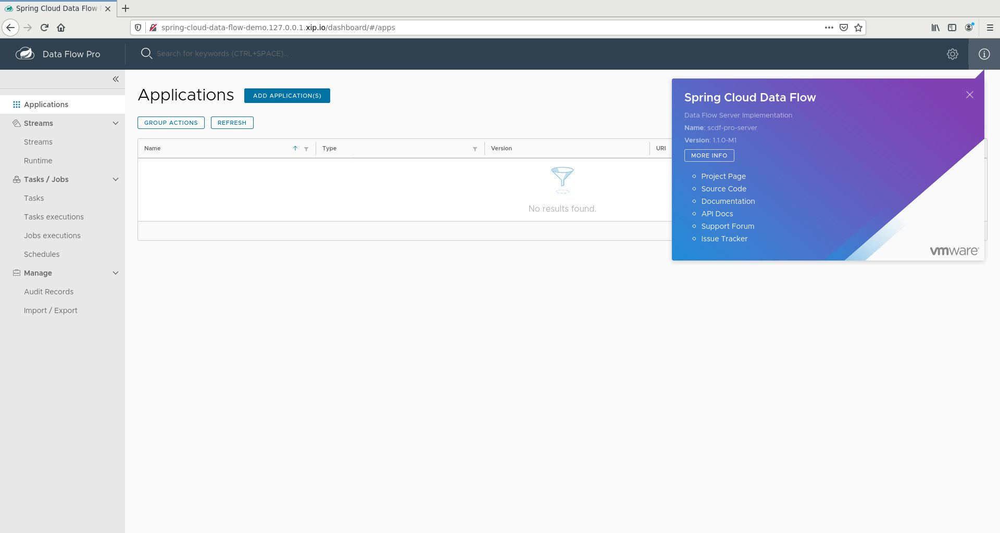
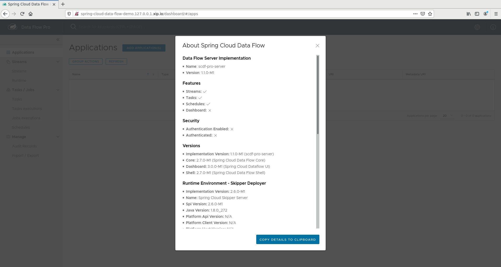

# spring-cloud-data-flow

Provide API Spring Cloud Data Flow [1.2.0-beta-1](https://network.pivotal.io/products/p-scdf-for-kubernetes/#/releases/774091) capability in current kubernetes cluster. Detailed manual

[Installation Instructions](https://docs.pivotal.io/scdf-k8s/1-1/preparing-to-install-scdf-for-kubernetes.html)


## Architecture

RPK's architecture can be found [here](../../../docs/ARCHITECTURE.md)


## Resource Sizing Requirements

The following sizing requirements must be met for this role to operate properly.  Sizing includes additional [dependencies](#dependencies).

| vCPU | Memory | Storage |
| --- | --- | --- |
| 2500m | 3Gi | N/A - no persistent storage required |

## Variables

### Default Variables

The following variables are defaulted in the `common/vars/main.yaml` file and require no additional user input.

| Variable Name                                     | Description                                                               | Default Value                      | Variable Type | Required |
|---------------------------------------------------|---------------------------------------------------------------------------|------------------------------------|---------------|----------|
| tanzu_spring_cloud_data_flow.namespace              | Namespace for Spring Cloud Data Flow components                                    | tanzu-spring-cloud-data-flow ( do not change )    | string        | yes      |
| tanzu_spring_cloud_data_flow.staging_dir            | Local directory to write the staging manfiests to                         | "{{ rpk_staging_dir }}/tanzu-spring-cloud-data-flow" | string        | yes      |
| tanzu_spring_cloud_data_flow.registry.project.project_name | Harbor Registry name to use                                        | spring-cloud-data-flow                      | string        | yes      |
| tanzu_spring_cloud_data_flow.registry.source_url    | Source Spring Cloud Data Flow Registry URL ( do not change )                 | registry.pivotal.io                | string        | yes      |
| tanzu_spring_cloud_data_flow.registry.source_project    | Source Spring Cloud Data Flow source project name ( do not change )                 | p-scdf-for-kubernetes                | string        | yes      |
| tanzu_spring_cloud_data_flow.workload_tenancy.enabled      | Whether to use the `workload-tenancy` module to provide custom namespaces | false                       | boolean       | yes      |
| tanzu_spring_cloud_data_flow.dns               | Ingress route to demo url                                                 | http://{{ tanzu_spring_cloud_data_flow.dns }                                  | string       | yes       |
| tanzu_spring_cloud_data_flow.registry.migrate_images      | Whether or not to migrate images to a local Harbor registry | true                       | boolean       | yes      |

### Additional Variables

The following variables must be set for proper operation of the role.  Variables are generally set in the variables file
at `build/inventory.yaml` of the root of this project.

| Variable Name                         	| Description                                                                                     	| Default Value 	| Variable Type 	| Required 	|
|-------------------------------------  	|-----------------------------------------------------------------------------------------------  	|---------------	|---------------	|----------	|
| tanzu_kubectl_context                 	| Name of context to use for connection to Kubernetes                                             	| -             	| string        	| yes      	|
| tanzu_spring_cloud_data_flow_username 	| credentials for source registry (refer to : tanzu_spring_cloud_data_flow.registry.source_url )  	| -             	| string        	| yes      	|
| tanzu_spring_cloud_data_flow_password 	| credentials for source registry (refer to : tanzu_spring_cloud_data_flow.registry.source_url )  	| -             	| string        	| yes      	|

## Dependencies

Also see `.dependencies.yaml` to view role dependencies which are run when running the role
independently.

* security
* ingress
* container-registry

### Optional: Using images from public repo (debug purposes only)

If you want test functionality of the role and omit images relocation from
`registry.pivotal.io` to RPK Harbor image registry, you can do following:

* comment out in `roles/enxtnsions/spring-cloud-data-flow/tasks/main.yaml`
  ```yaml
  - name: "initiate image migration"
    include_tasks: migrate-image-task.yaml
  ```
* comment `registry.pivotal.io` and uncomment `index.docker.io` images in :

```
roles/enxtnsions/spring-cloud-data-flow/templates/dev/spring-cloud-data-flow/skipper/spring-cloud-data-flow-skipper-deployment.yaml.j2
roles/enxtnsions/spring-cloud-data-flow/templates/dev/spring-cloud-data-flow/data-flow/spring-cloud-data-flow-config.yaml.j2
roles/enxtnsions/spring-cloud-data-flow/templates/dev/spring-cloud-data-flow/data-flow/spring-cloud-data-flow-deployment.yaml.j2
```


## Deploying

**NOTE:** roles from `.dependencies.yaml` are also deployed.

In order to deploy the role from a versioned image:

```bash
ROLE=extensions/spring-cloud-data-flow make deploy.role
```

If you've made changes to the role and need to verify your changes:

```bash
ROLE=extensions/spring-cloud-data-flow make deploy.test.role
```

## Demonstrating

Once the role has run successfully, you should be able to demonstrate the role.

Brief description of what the demonstration does here.

In order to demonstrate the role:

```bash
ROLE=extensions/spring-cloud-data-flow make demo.role
```

Sample output:

```bash
kubectl get all -n tanzu-spring-cloud-data-flow

NAME                               READY   STATUS    RESTARTS   AGE
pod/postgresql-0                   1/1     Running   0          10m
pod/rabbitmq-0                     1/1     Running   0          10m
pod/scdf-server-5df867688b-fgw9l   1/1     Running   0          9m19s
pod/skipper-5cdff9c658-rv2hk       1/1     Running   0          10m

NAME                          TYPE        CLUSTER-IP      EXTERNAL-IP   PORT(S)                                 AGE
service/postgresql            ClusterIP   10.96.110.172   <none>        5432/TCP                                10m
service/postgresql-headless   ClusterIP   None            <none>        5432/TCP                                10m
service/rabbitmq              ClusterIP   10.96.51.22     <none>        4369/TCP,5672/TCP,25672/TCP,15672/TCP   10m
service/rabbitmq-headless     ClusterIP   None            <none>        4369/TCP,5672/TCP,25672/TCP,15672/TCP   10m
service/scdf-server           NodePort    10.96.192.198   <none>        80:31645/TCP                            9m20s
service/skipper               ClusterIP   10.96.26.28     <none>        80/TCP                                  10m

NAME                          READY   UP-TO-DATE   AVAILABLE   AGE
deployment.apps/scdf-server   1/1     1            1           9m19s
deployment.apps/skipper       1/1     1            1           10m

NAME                                     DESIRED   CURRENT   READY   AGE
replicaset.apps/scdf-server-5df867688b   1         1         1       9m19s
replicaset.apps/skipper-5cdff9c658       1         1         1       10m

NAME                          READY   AGE
statefulset.apps/postgresql   1/1     10m
statefulset.apps/rabbitmq     1/1     10m


kubectl get ingress -n tanzu-spring-cloud-data-flow

NAME           CLASS    HOSTS                                          ADDRESS   PORTS   AGE
scdf-ingress   <none>   spring-cloud-data-flow-demo.127.0.0.1.nip.io             80      89s

```

Accessing the service:

```bash

curl http://spring-cloud-data-flow-demo.{{ tanzu_ingress_domain }}/about
open http://spring-cloud-data-flow-demo.{{ tanzu_ingress_domain }}/dashboard/#/apps

```

Dashboard



Dashboard/About



## Cleaning

To remove the role, from the root of the repo:

**NOTE:** only this role is removed and not the role dependencies.

```bash
ROLE=extensions/spring-cloud-data-flow make clean.role
```

## Author(s)
[Andriy Kalashnykov](mailto:akalashnykov@vmware.com)
