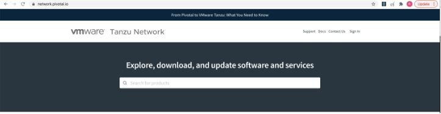
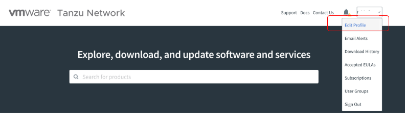
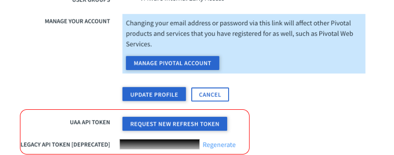

# Spring Cloud Gateway

Provide API gateway capability in current kubernetes cluster.

## Architecture

RPK's architecture can be found [here](../../../docs/ARCHITECTURE.md)


## Resource Sizing Requirements

The following sizing requirements must be met for this role to operate properly.  Sizing includes additional [dependencies](#dependencies).

| vCPU | Memory | Storage |
| --- | --- | --- |
| 2500m | 3Gi | N/A - no persistent storage required |

## Variables

### Default Variables

The following variables are defaulted in the `common/vars/main.yaml` file and require no additional user input.

| Variable Name | Description | Default Value | Variable Type | Required |
|---------------|-------------|---------------|---------------|----------|
| tanzu_spring_cloud_gateway.namespace | Namespace for Spring Cloud Gateway components | tanzu-spring-cloud-gateway | string | yes |
| tanzu_spring_cloud_gateway.staging_dir | Local directory to write the staging manifests to | "/tmp/staging/tanzu-spring-cloud-gateway" | string | yes |
| tanzu_spring_cloud_gateway.demo.dns | Ingress route to demo url | spring-cloud-gateway-demo.`dns` | string | yes |
| tanzu_spring_cloud_gateway.pivnet.version | Version of Spring Cloud Gateway to download from VMware Tanzu Network | 1.0.0 | string | yes |
| tanzu_spring_cloud_gateway.pivnet.download_url | VMware Tanzu Network download URL for Spring Cloud Gateway | https://network.pivotal.io/api/v2/products/spring-cloud-gateway-for-kubernetes/releases/835308/product_files/891162/download | string | yes |
| tanzu_spring_cloud_gateway.pivnet.download_sha | VMware Tanzu Network download SHA for Spring Cloud Gateway | 2420f5d32d3ee545cf4eaee10fe6730ed28130e03e5b04c19e5d25d50b0ff2ee | string | yes |
| tanzu_spring_cloud_gateway.registry.project.project_name | Project name to create for Spring Cloud Gateway images in the Harbor Registry | spring-cloud-gateway | string | yes |
| tanzu_spring_cloud_gateway.registry.project.metadata.auto_scan | Enable auto scan for the Spring Cloud Gateway project created in the Harbor registry | false | string | yes |
| tanzu_spring_cloud_gateway.registry.project.metadata.public | Enable public access for the the Spring Cloud Gateway project created in the Harbor registry | false | string | yes |
| tanzu_spring_cloud_gateway.registry.destination_tag | Destination tag for the Spring Cloud Gateway images in the Harbor registry | ivy-1.0 | string | yes |
| tanzu_spring_cloud_gateway.registry.images.name | Array of image names downloaded from VMware Tanzu Network to be stored in Harbor registry | scg-operator/gateway | string | yes |
| tanzu_spring_cloud_gateway.registry.images.tag | Array of matching tags for images to be stored in Harbor registry | 1.0.0 | string | yes |
| tanzu_spring_cloud_gateway.workload_tenancy.enabled | Whether to use the `workload-tenancy` module to provide custom namespaces | false | boolean | yes |

### Additional Variables

The following variables must be set for proper operation of the role.  Variables are generally set in the variables file
at `build/inventory.yaml` of the root of this project.

| Variable Name | Description | Default Value | Variable Type | Required |
|---------------|-------------|---------------|---------------|----------|
| tanzu_kubectl_context | Name of context to use for connection to Kubernetes | - | string | yes |
| tanzu_network_api_token | API token for VMware Tanzu Network | - | string | yes |

## Retrieve API token from VMware Tanzu Network

* Navigate to https://network.pivotal.io/ and proceed to login.

    

* Navigate to edit profile.

    

* Scroll down to retrieve the token from "Legacy API token" field.

    

## Dependencies

Also see `.dependencies.yaml` to view role dependencies which are run when running the role
independently.

* security
* ingress
* container-registry

## Deploying

**NOTE:** roles from `.dependencies.yaml` are also deployed.

In order to deploy the role from a versioned image:

```bash
ROLE=spring-cloud-gateway make deploy.role
```

If you've made changes to the role and need to verify your changes:

```bash
ROLE=spring-cloud-gateway make deploy.test.role
```

## Demonstrating

Once the role has run successfully, you should be able to demonstrate the role.

Brief description of what the demonstration does here.

In order to demonstrate the role:

```bash
ROLE=spring-cloud-gateway make demo.role
```

Sample output:

```bash
kubectl get springcloudgateway -n tanzu-spring-cloud-gateway
NAME           READY   REASON
test-gateway   True    Created

kubectl get pods/test-gateway-0 -n tanzu-spring-cloud-gateway
## test-gateway generated by Spring Cloud Gateway Operator (refer to demo/templates/test-gateway.yaml.j2)
NAME             READY   STATUS    RESTARTS   AGE
test-gateway-0   1/1     Running   0          4m6s
```

Accessing the service:

```bash
curl http://<tanzu_spring_cloud_gateway.demo.dns>/test/<any github id>
```

You can also open http://<tanzu_spring_cloud_gateway.demo.dns>/test from your browser and it will proxy github.com.

## Cleaning

To remove the role, from the root of the repo:

**NOTE:** only this role is removed and not the role dependencies.

```bash
ROLE=spring-cloud-gateway make clean.role
```

## Author(s)

* [Robin Foe](mailto:rfoe@vmware.com)
* [Paul Wiggett](mailto:pwiggett@vmware.com)
